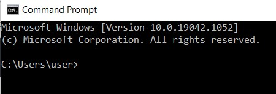
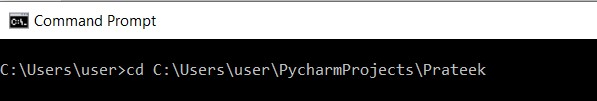
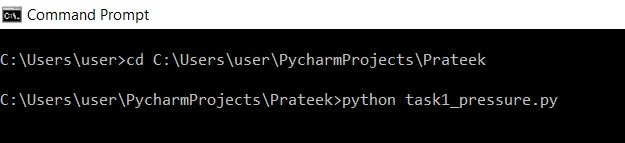
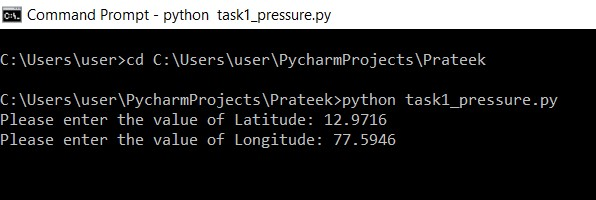
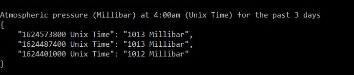

## Show Atmospheric pressure at 4am for the past 3 days

**API used:**
```
  https://openweathermap.org/api
```
**Service Used:**
```
Historical weather data
```

**Input:**
```
User Input Latitude and Longitude value
for which the atmospheric pressure has to be retrieved.
```
**Output:**
```
JSON format data, unix timestamp and pressure values for past 3 days.
```

### Python Dependencies

1. **requests**
*Standard for making HTTP requests in Python*

2. **datetime**
*Supplies classes for manipulating dates and times*

3. **timezonefinder**
*For finding the timezone of any point on earth*

4. **pytz**
*Allows accurate and cross platform timezone calculations*

5. **json**
*Convert the Python objects into respective JSON object*

#### Prerequisites
1. Install Python in your system ([windows](https://phoenixnap.com/kb/how-to-install-python-3-windows) or [mac OS](https://flaviocopes.com/python-installation-macos/))
2. Install above mentioned python dependencies (packages) via [pip](https://www.datacamp.com/community/tutorials/python-install-pip).

## Instructions to run the API
##### using command line

1. Open Command Prompt / Terminal



2. Navigate to the path where python script is placed



3. Execute the python script

```
python task1_pressure.py
```



4. Enter the value of Latitude and Longitude



5. Output is displayed



## Logic for Code

- User input the latitude and longitue value.
- Evaluate the timezone as per the coordinates entered
- Evaluate the Unix timestamp for current day's 04:00 AM.
- Calculate unix timestamps for last 3 days
- Call API https://openweathermap.org/api (**GET** request), with latitude, longitude, past three days timestamp (one day at a time) and appId.

    ```
    https://api.openweathermap.org/data/2.5/onecall/timemachine?lat=12.9716&lon=77.5946&dt=1624582380&appid=78385f931961ae9b80060c70d2c7bf6f
    ```

- Create an dictionary to store the output values.
- Unix Timestamp and Pressure value received are stored in the dictionary.
- JSON object is prepared for the dictionary and displayed as output.
